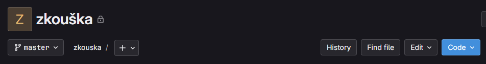
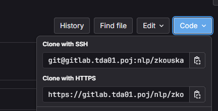
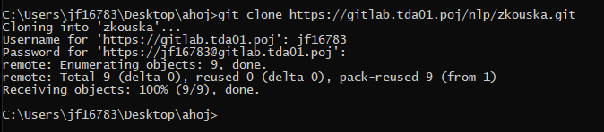

# Vytvoření nového repozitáře
- Někde (třeba v lokálním úložišti) si vytvořím složku, ve které budu chtít pracovat
    - Pro účely tohoto návodu se složka bude jmenovat **ahoj** a bude uložena na ploše
- Na Gitlabu vytvořím repozitář (prázdný, nebo třeba s readme souborem)
    - Pro účely tohoto návodu se repozitář bude jmenovat **zkouška**



# Klonování již existujícího repozitáře (ahoj)
- klonujeme pomocí **HTTPS** (SSH nefunguje)
- kopíruji odkaz na repozitář (zkouška)
    - jdu do repozitáře na GitLabu
    - Code -> Clone with HTTPS -> Copy
    

- v příkazovém řádku potřebuji stát ve složce, kam chci repozitář naklonovat, např. složka **ahoj**
    - metoda A: 
        - otevřu složku v prohlížeči souborů
        - pravé tlačítko myši -> Zobrazit další možnosti (příp. shift + right click)
        - Otevřít v Terminálu (příp. otevřít zde okno PowerShell)
    - metoda B:
        - otevřu kdekoliv příkazový řádek
        - pomocí příkazu cd a cesty ke složce se do složky přesunu
        - např:
        ```
        > cd C:\Users\jf16783\Desktop\ahoj
        ```
- do cmd píšu **git clone <link>**, např.:
```
> git clone https://gitlab.tda01.poj/nlp/zkouska.git
```



- ve složce se mi objevila nová složka (repozitář)
- repozitář je automaticky nalinkovaný na vzdálený repozitář na gitlabu

# Práce v lokálním repozitáři
- ve svém lokálním repozitáři mohu pracovat normálně, jak jsem zvyklý
- práci bych měl pravidelně ukládat a dělat tzv. **commity** (verzovat)

## Lokální verzování (commity)
1. __git fetch__
    - stáhne případné změny ve vzdáleném repozitáři
    (nepracoval mi tam někdo?)
1. __git status__
    - velmi užitečný příkaz, doubré pouštět často
    - ukáže mi např. jestli je třeba 
1. (__git pull__)
    - pokud po **git status** vidím, že jsou ve vzdáleném repozitáři změny, chci si je stáhnout k sobě
1. __git add__
    - když v repozitáři udělám nějakou změnu, musím se rozhodnout, jestli ji chci trackovat, nebo ne
    - k tomu slouží příkaz git add
    - v případě, že chci změny trackovat pouze u vybraných souborů:
    ``` 
    > git add <file_name.extension>
    ```
    - v případě, že chci změny sledovat u všech souborů, potom:
    ```
    > git add .
    ```
1. (__git status__) 
    - jen tak pro kontrolu
1. __git commit -m " ... "__
    - tady už vytvářím verzi (snapshot) repozitáře
    - každý commit musí obsahovat zprávu, o co v této verzi jde
    - např. 
    ```
    > git commit -m "add new file abc.md"
    ```
    - takhle můžu lokálně pracovat libovolně dlouho, ale všechnu práci mám uloženou pouze lokálně
    - pokud chci práci uložit na GitLab / GitHub, apod., musím provést tzv. **push**
1. __git push__
    - tímto příkazem změny posílám na vzdálený repozitář na GitLab / GitHub, apod.
    - budu vyzván k zadání hesla


# Základní příkazy - shrnutí

Všechny příkazy začínají klíčovým slovem **git**.

|cmd příkaz|popis|
|-|-|
|git status|zobrazí status repozitáře|
|git add + filename.extension | Přidá <filename.extension> do staging area (u souboru chci sledovat změny)|
|git add .|přidá celý obsah repozitáře do staging are (kromě obsahu souboru .gitignore)|
|git commit -m "message" | vytvoří commit + název commitu|
|git clone + https link |Klonuji GitLab repozitář do lokálu|
|git push| pushuji lokální repozitář do GitLabu|
|git pull|stahuji up-to-date verzi repozitáře z GitLabu|

### Další příkazy:

|cmd příkaz|popis|
|-|-|
|git log --oneline|zobrazí lokální historii commitů|
|git branch||
|git checkout||
|git diff||
|git config (--global) user.name ("...")| omit global for local setting, omit "..." for just check|
|git config (--global) user.email ("...")| omit global for local setting, omit "..." for just check|
|git remote -v| display remote repos|
|git remote set-url origin https://github.com/yourusername/yourrepo.git | change remote repo|
|git reset | reset the "git add" command|
|git reset --hard|reset to the last commit (discard current changes)|
|git reset --hard <commit_hash>|reset to the specified commit (all subsequent commits will be discarded)|

